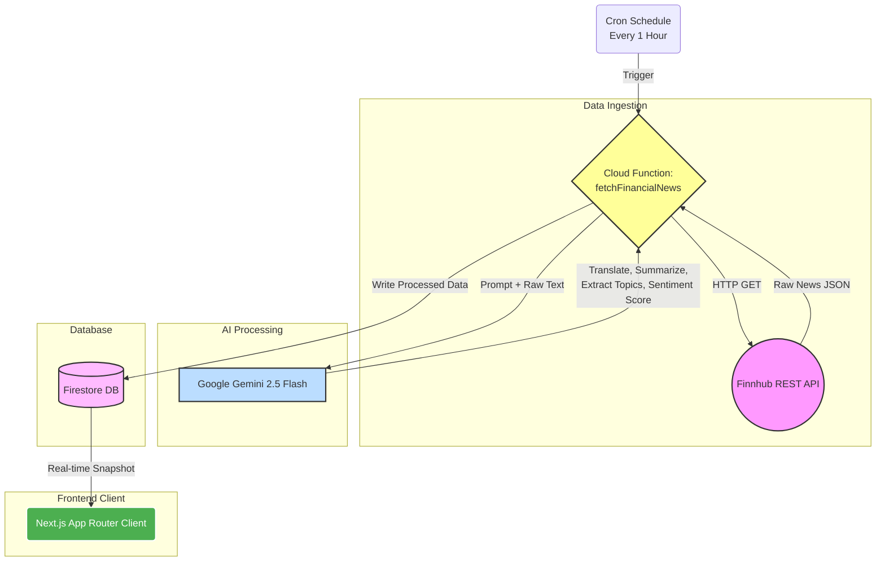

# Trendboard 📈

<div align="center">
 
 

 


 
</div>

Trendboard is an autonomous, AI-powered financial intelligence dashboard that automatically aggregates, translates, analyzes, and visualizes global market news in real-time.

Built as a modern, full-stack Next.js application, Trendboard utilizes Google's Gemini 2.5 Flash LLM to autonomously extract sentiment, underlying topics, and market movement predictions from raw data feeds, completely eliminating the need for manual curation or translation.

## 🏗 System Architecture



### 1. The Autonomous Ingestion Pipeline (Backend)
- **Data Sourcing:** A Firebase Cloud Function (`fetchFinancialNews`) triggers on a cron schedule to fetch the latest breaking news from the **Finnhub API** across multiple sectors (General Market, Crypto, Forex, Mergers).
- **AI Processing (Gemini 2.5 Flash):** Instead of saving raw text, the Cloud Function passes the article data to Google's Gemini LLM with strict JSON schema instructions to:
  - Detect non-English articles (Chinese, French, etc.) and seamlessly translate them into English.
  - Generate a concise 1-2 sentence summary.
  - Extract the top 3 core financial topics (e.g., `#Acquisition`, `#SupplyChain`, `#InterestRates`).
  - Score the article's financial sentiment on a continuous scale from -1.0 (Bearish) to +1.0 (Bullish).
- **Data Storage:** The structured, translated, and scored JSON data is saved to **Cloud Firestore** (`newsArticles` collection). Concurrently, the extracted topics are tracked in the `topicStats` collection to maintain a running frequency tally.

### 2. The Analytical Engine (Backend Analytics)
- **Market Pulse Calculation:** After processing a news batch, the Cloud Function calculates a proprietary "Market Pulse Score." This is derived by averaging the AI-generated sentiment scores of all recent articles, scaled logarithmically by volume (`averageSentiment * Math.log1p(articleCount)`), providing a real-time, mathematical indicator of overall market sentiment.
- **IPO Heat Tracking:** The AI specifically monitors for IPO-related topics and increments a dedicated tracker to monitor the frequency of initial public offering discussions in the news cycle, alerting users to surging activity.

### 3. The Interactive Dashboard (Frontend)
- **Framework:** Built with **Next.js (App Router)** and **React 19** for maximum performance and SEO capabilities.
- **Styling:** Engineered with **Tailwind CSS v4** utilizing a custom, minimal, dark-mode-first fintech aesthetic (glassmorphism, subtle borders, high-contrast typography).
- **Authentication:** Secured by **Firebase Auth**, offering both Google Sign-In and traditional Email/Password registration. Unauthenticated users are seamlessly granted "Anonymous Sessions" to interact with specific premium features before committing.
- **Data Visualization:** Utilizes **Recharts** to query the `topicStats` Firestore collection and dynamically generate an interactive Area Chart representing the most frequently discussed AI-extracted topics over time.

## 🔒 Security Architecture (Firestore Rules)
To ensure the integrity of the AI-generated financial data, strict NoSQL security rules are enforced. The client is restricted to Read-Only access, while Write permissions are strictly isolated to the authenticated Cloud Function backend:

```javascript
rules_version = '2';
service cloud.firestore {
  match /databases/{database}/documents {
    // Analytics & Processed News: Publicly readable for the dashboard, but strictly sealed from client writes.
    // ONLY the backend Cloud Function architecture can write or modify this data.
    match /newsArticles/{document=**} {
      allow read: if true;
      allow write: if false; 
    }
    match /topicStats/{document=**} {
      allow read: if true;
      allow write: if false;
    }
    match /marketPulse/{document=**} {
      allow read: if true;
      allow write: if false;
    }
    
    // User Profiles: Securely isolated. Users can only read/write their own preferences.
    match /users/{userId} {
      allow read, write: if request.auth != null && request.auth.uid == userId;
    }
  }
}
```

## 🎯 Key Design Decisions

1. **AI-First Data Engineering:** Rather than building complex NLP pipelines or relying on expensive third-party translation APIs, we utilized a single, highly-optimized prompt to Gemini 2.5 Flash. This reduced backend complexity by 80% while simultaneously handling translation, summarization, entity extraction, and sentiment analysis in a single, cheap API call.
2. **Serverless Architecture:** By combining Next.js with Firebase (Auth, Firestore, Functions), the entire infrastructure is serverless. This ensures infinite scalability during traffic spikes (e.g., breaking market news) while maintaining near-zero costs during downtime.
3. **NoSql Data Modeling:** Firestore was chosen over a relational database to allow for rapid, schema-less iteration. The separation of `newsArticles` and `topicStats` collections allows the Recharts frontend to load the topic graph instantly without having to aggregate thousands of individual articles on the client-side.
4. **"Explain This Trend" Feature:** To provide immediate value, an interactive "Explain Trend" button calls a dedicated Cloud Function that re-prompts Gemini to act as a senior financial advisor, explaining the short and long-term impact of any specific news event on demand.

## 🛠 Tech Stack

*   **Frontend:** Next.js (App Router), React, TypeScript, Tailwind CSS v4, Lucide React (Icons), Recharts
*   **Backend:** Firebase (Firestore, Authentication, Cloud Functions), Node.js
*   **AI Engine:** Google Generative AI (Gemini 2.5 Flash)
*   **Data Providers:** Finnhub REST API
*   **Deployment:** Vercel (Frontend), Google Cloud (Firebase Backend)

## 💻 Running Locally

1. Setup your Firebase Project and retrieve your Web Config keys.
2. Ensure you have activated Firebase Authentication (Google & Email/Password), Firestore Database, and Cloud Functions.
3. Obtain API keys from [Finnhub](https://finnhub.io/) and [Google AI Studio (Gemini)](https://aistudio.google.com/).

```bash
# Install dependencies
npm install

# Setup environment variables
# Copy .env.example to .env.local and fill in your keys
cp .env.example .env.local

# Run the development server
npm run dev
```

Next, open a second terminal to manage the Cloud Backend:

```bash
# Navigate to the functions directory
cd functions

# Install backend dependencies
npm install

# Inject your secure API keys into the local Firebase emulator
# You must set FINNHUB_API_KEY and GEMINI_API_KEY as environment variables for the emulator to read.

# Start the Firebase Emulator to test Cloud Functions locally
npm run serve
```
